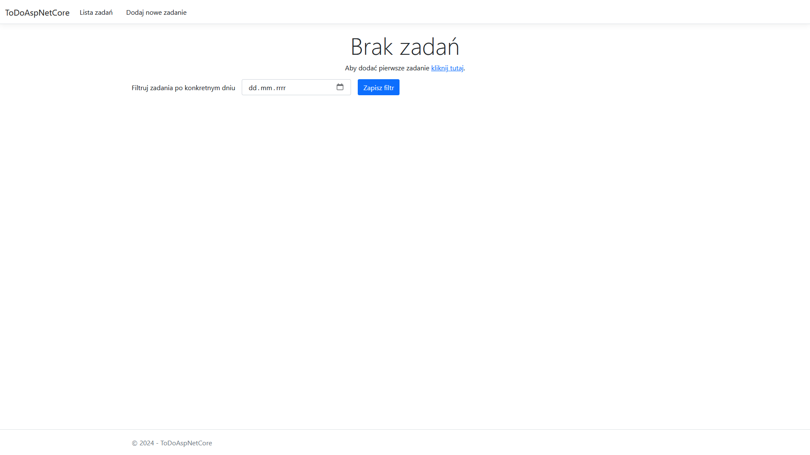
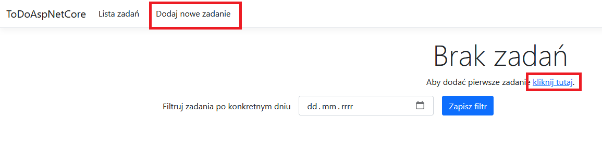
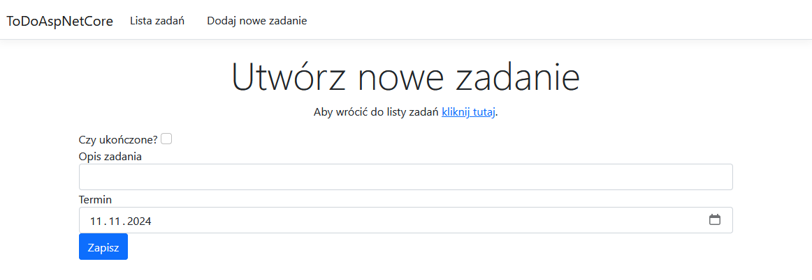
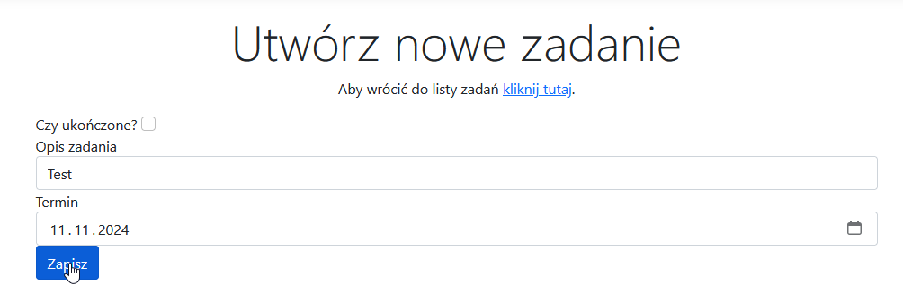
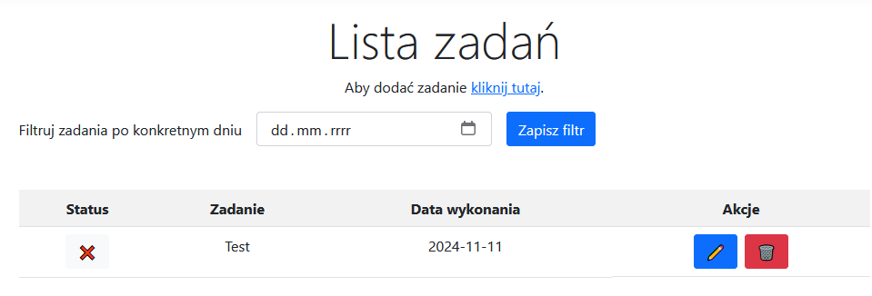
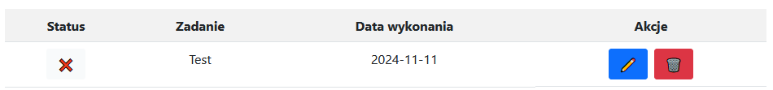
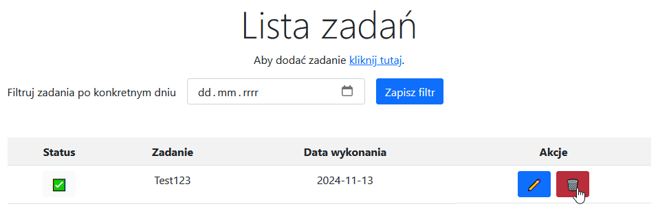
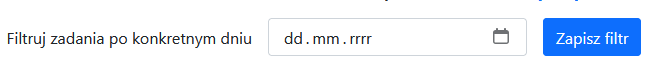
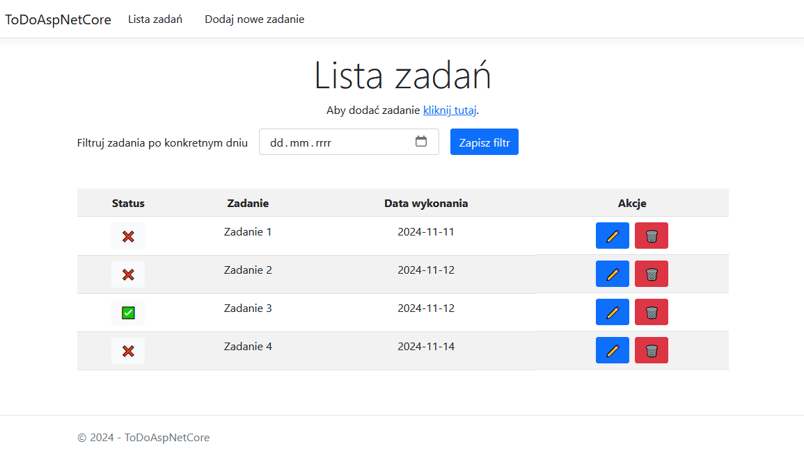

# ToDoAspNetCore - instrukcja użytkowania
Wykorzystane technologie:
- ASP.NET Core 8.0
- Entity Framework Core
- JavaScript
- Bootstrap 5
- SQL Server Express (lokalnie)
- GitHub
- GitHub Actions
- SQL Server Management Studio
- Azure - hosting aplikacji (App Service, Azure SQL)

# Instrukcja użytkowania
Po uruchomieniu głównej strony aplikacji pojawia się następujący ekran:

Aby dodać nowe zadanie należy przejść do formularza tworzenia nowych zadań. Aby to zrobić należy kliknąć jeden z linków pokazanych na obrazie poniżej:

Formularz dodawania nowego zadania wygląda następująco:

Po wypełnieniu formularza należy kliknąć przycisk "Zapisz".

Po dodaniu zadania zostaniemy przekierowani na stronę główną aplikacji, gdzie zobaczymy dodane zadanie:

Na liście widoczna jest ikona pokazująca status zadania. Ikona ❌ oznacza, że zadanie nie zostało wykonane, a ikona ✅ oznacza, że zadanie zostało wykonane.

Istnieje możliwość szybkiej edycji statusu bezpośrednio z listy zadań. Aby to zrobić należy kliknąć na ikonę statusu zadania. Po kliknięciu na ikonę statusu zadania, status zadania zostanie zmieniony na przeciwny.

Po kliknięciu przycisku z ikoną ołówka ✏️, następuje przekierowanie na stronę edycji zadania. Na tej stronie można edytować treść zadania, status zadania oraz datę wykonania. Po zapisaniu zmian następuje przekierowanie na stronę główną aplikacji.

Po kliknięciu przycisku z ikoną kosza 🗑️, następuje usunięcie zadania. Po usunięciu zadania następuje odświeżenie listy zadań.

Lista zadań zawiera filtr umożliwiający wyświetlenie zadań z danego dnia. Aby wyświetlić zadania z danego dnia należy wybrać datę w filtrze.

Działanie filtra zostało przedstawione na animacji poniżej:

# Potencjalne problemy
- **długi czasładowania aplikacji lub występujący błąd** - ze względu na ograniczenia darmowych zasobów na platformie Azure aplikacja może wyjść ze stanu uśpienia szybciej od bazy danych - należy spróbować odświeżyć stronę po upływie około 30 sekund
- **brak możliwości korzystania z aplikacji** (nawet po późniejszej próbie odświeżenia strony) - możliwe, że został przekroczony limit darmowych zasobów na platformie Azure - w takim przypadku należy poczekać do następnego dnia, aby aplikacja mogła ponownie działać